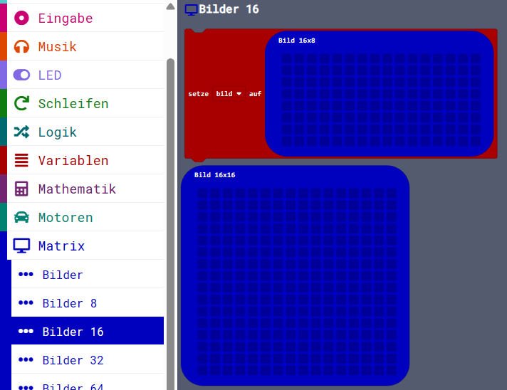

> Diese Seite bei [https://calliope-net.github.io/matrix/](https://calliope-net.github.io/matrix/) öffnen.

### Calliope I²C Erweiterung für OLED Displays 128x128 und 128x64 Pixel

> speichert alle Pixel im RAM (2048 oder 1024 Byte), deshalb Calliope mini ab V2 erforderlich

> zeichnet Linien, Kreise oder eine analoge Uhr

> Bilder verschiedener Größe 5x8 bis 64x64 Pixel mit Blöcken selbst malen

> Text pixelgenau positionieren, drehen, spiegeln, in verschiedene Richtungen zeichnen

> Bilder (auch Text-Zeichen sind Bilder 5x8) vergrößern (in x und y Richtung getrennt strecken)

> mehrere Bilder als Animation anzeigen

> zwei Displays mit verschiedenen I²C Adressen können verschiedene Bilder zeigen

Erweiterung unterstützt verschiedene OLED Displays, folgende wurden getestet:

* [Grove - OLED Display 1.12 (SH1107) V3.0 - SPI/IIC -3.3V/5V](https://wiki.seeedstudio.com/Grove-OLED-Display-1.12-SH1107_V3.0/)

_V3.0/img/10402050_Main-02.png)

* [Grove - OLED Display 0.96 inch](https://wiki.seeedstudio.com/Grove-OLED_Display_0.96inch/)

* [Grove - OLED Yellow&Blue Display 0.96(SSD1315) - SPI/IIC -3.3V/5V](https://wiki.seeedstudio.com/Grove-OLED-Yellow&Blue-Display-0.96-SSD1315_V1.0/)

_V1.0/img/10402049_Preview-07.png)

Dieses Repository kann als **Erweiterung** in MakeCode hinzugefügt werden.

* öffne Makecode in der App oder die Webseite [https://makecode.calliope.cc/](https://makecode.calliope.cc/)
* klicke auf **Neues Projekt** und gib deinem Projekt einen Namen
* wähle die zu deinem Calliope mini passende Hardware v2 oder v3
* mit Calliope 1.3 (v1) funktioniert diese Erweiterung nicht
* klicke auf **Erweiterungen**
* schreibe die folgende **Projekt-URL**:
* **calliope-net/matrix**
* mit der Tastatur oben in das weiße Feld und klicke auf ENTER
* klicke auf das Rechteck **matrix** (kann von der Tastatur verdeckt sein)
* jetzt hat die Liste den neuen Eintrag **Matrix** bekommen

### Beschreibung der Erweiterung 'Matrix'

#### RAM

> RAM ist der Datenspeicher im Computer. Im Gegensatz zum ROM (Read-Only-Memory) können die Daten im RAM jederzeit vom Programm geändert werden.

→ [de.wikipedia.org/wiki/Random-Access_Memory](https://de.wikipedia.org/wiki/Random-Access_Memory)

> Die Calliope mini Versionen haben unterschiedliche RAM Speicher Kapazität: 1.3=16KB | 2.0 und 2.1=32KB | 3.0=128KB.
> Der RAM wird auch vom Betriebssystem benutzt, so dass für eigene Programme nicht viel übrig bleibt.
> Beim Calliope mini 1.3 reichen die 16KB jedenfalls nicht, um 1KB für die Matrix zu reservieren.

→ [Technische Spezifikation](https://calliope-mini.github.io/v20/)

> 1K steht für 2^10 = 1024 und B für Byte. 1 Byte hat immer 8 Bit. 1KB sind also 8192 Bit, so viele Pixel hat das 128x64 Display.
> Und Pixel sind die kleinen Punkte, die leuchten oder nicht. Die Erweiterung 'Matrix' schaltet tausende Pixel an und aus, damit ein Bild entsteht.

#### I²C

→ [calliope-net.github.io/i2c](https://calliope-net.github.io/i2c/)

Matrix speichert alle Pixel im RAM. Zur Kommunikation mit dem Display über den I²C-Bus gibt es nur 3 Blöcke (hellblau):

* **beim Start** (Display-Größe, invert, drehen, I²C-Adresse)
* **Matrix auf Display schreiben** (Zeilen von, bis, I²C-Adresse)
* **Animation auf Display schreiben** (Image[]-Array, Position x, y, Vergrößern x, y, Pause(ms), Zeilen von, bis, I²C-Adresse)

##### OLED Display I²C

Block **beim Start** (Display-Größe, invert, drehen, I²C-Adresse)

muss beim Start aufgerufen werden, um den RAM (die Matrix) und das Display zu initialisieren. 
Die eingestellte *Display-Größe* entscheidet darüber, wieviel RAM reserviert wird. 128x64 reserviert 1KB und 128x128 2KB.
*invert* stellt ein, ob die Pixel leuchten oder der Hintergrund. 
Mit *drehen* wird das Bild auf den Kopf gestellt, wenn das Display anders herum eingebaut ist.
Die *I²C-Adresse* muss nur umgestellt werden, wenn ein zweites Display angeschlossen wird.

Die optionalen Parameter können weg gelassen werden. Sie werden bei Bedarf mit dem + angezeigt.

> Wenn zwei Displays angeschlossen sind, muss der Block **beim Start** zweimal aufgerufen werden, mit verschiedenen I²C-Adressen.
> RAM wird für das größere Display reserviert. Es gibt nur eine Matrix im RAM, die sich beide Displays teilen.
> Um verschiedene Bilder auf zwei Displays anzuzeigen, wird die Matrix gelöscht, neu gezeichnet und mit dem folgenden Block
> (mit Parameter I²C-Adresse) an ein bestimmtes Display gesendet.

Block **Matrix auf Display schreiben** (Zeilen von, bis, I²C-Adresse)

ist immer aufzurufen, wenn das in den RAM gezeichnete Bild (die Matrix) angezeigt werden soll.
Dabei wird normalerweise das komplette Display über den I²C-Bus neu geschrieben (1KB oder 2KB Pixel).
Mit den optionalen Parametern *Zeilen von, bis* ist es möglich, nur einen Teil des Displays zu aktualisieren. 
Eine Zeile ist immer 8 Pixel hoch und 128 Pixel breit, füllt also die gesamte Breite des Displays.
Das 128x64 Display hat damit 8 Zeilen (0-7), das 128x128 Display hat 16 Zeilen (0-15).

Der Parameter *I²C-Adresse* bestimmt, an welches Display die Matrix gesendet wird.

> Die Zeilen im RAM und auf dem Display sind fest zugeordnet. Sie können nicht an eine andere Stelle geschrieben werden.

Block **Animation auf Display schreiben** befindet sich im Menüpunkt **[Bilder Array](#bilder-array)** und wird dort beschrieben. 

##### Matrix im Speicher

Block **Matrix löschen** (Zeilen von, bis)

Damit werden normalerweise alle Pixel im gesamten RAM (die Matrix) gelöscht.
Mit den optionalen Parametern (Zeilen von, bis) ist es möglich, nur einen Teil der Matrix zu löschen.
Eine Zeile ist immer 8 Pixel hoch und 128 Pixel breit.

> Um das Display zu löschen, muss eine gelöschte Matrix noch mit dem hellblauen Block **Matrix auf Display schreiben**
> über den I²C-Bus an das Display gesendet werden.

Block **set Pixel** (x, y, EIN/AUS)

Schaltet ein Pixel (im RAM) EIN oder AUS. 

> Für die Koordinate x sind Werte von 0 (links) bis 127 (rechts) erlaubt.
> Für die Koordinate y sind Werte von 0 (oben) bis 63 oder 127 (unten) erlaubt.

Block **get Pixel** (x, y) : boolean

Liest ein Pixel aus dem RAM als boolean (wahr=EIN, falsch=AUS).

Block **Linie** (von x, y, bis x, y, Pixel EIN/AUS)

Zeichnet eine Linie mit den angegebenen Koordinaten in den RAM. Mit *Pixel* AUS werden die Pixel gelöscht.

Block **Kreis** (Mittelpunkt x, y, Radius, Pixel EIN/AUS)

Zeichnet einen Kreis mit den angegebenen Koordinaten in den RAM. Mit *Pixel* AUS werden die Pixel gelöscht.

> Für Linie und Kreis wird der Bresenham-Algorithmus verwendet:
> [de.wikipedia.org/wiki/Bresenham-Algorithmus](https://de.wikipedia.org/wiki/Bresenham-Algorithmus)

##### Analog Uhr Zeiger

Block **12 Stunden** (Stunde, Mittelpunkt x, y, Linie von, bis, Pixel EIN/AUS)

Der Parameter *Stunde* bestimmt die Richtung (den Winkel) der Linie vom *Mittelpunkt x, y* (auf dem Zifferblatt einer Uhr).
Der "kleine Zeiger" muss nicht im Mittelpunkt beginnen. Die Parameter *Linie von, bis* bestimmen Anfang und Ende des Zeigers (vom Mittelpunkt in Pixeln).
Mit *Pixel* AUS kann der Zeiger auch wieder gelöscht werden.

Block **60 Minuten** (Minute, Mittelpunkt x, y, Linie von, bis, Pixel EIN/AUS)

Funktioniert wie **12 Stunden**, allerdings sind hier nicht 12, sondern 60 Positionen des Zeigers möglich.

> Die Funktionen für die Uhrzeiger hat ein Schüler im GTA programmiert.

Block **zeichne Uhr** (Mittelpunkt x, y, Stunde, Minute)

Verwendet die oben beschriebenen Funktionen, um eine komplette analoge Uhr zu zeichnen.

#### Bilder

Im Menüpunkt *Bilder* können Bilder (Image-Objekte) aus verschiedenen Quellen erzeugt und in Variablen gespeichert werden.
Die Image-Objekte werden dann an einer bestimmten Position (x, y) in den RAM (Buffer) gezeichnet.

##### Bild in Buffer zeichnen

Block **zeichne Bild** (Image-Objekt, x, y, überschreiben, vergrößern x, y)

In den 1. Parameter *Image-Objekt* muss eine Variable *bild* oder ein Block, der ein Image-Objekt zurück gibt, eingetragen werden.

Die Koordinaten *x, y* sind die linke obere Ecke, wo das Bild aus dem Image-Objekt in die Matrix gezeichnet wird. 
Dabei wird die volle Breite und Höhe des Bildes übertragen (bis zum Rand der Matrix).

Mit Parameter *überschreiben* werden alle Pixel (die Nullen und die Einsen) vom Image-Objekt in den RAM gezeichnet.
Mit Parameter *transparent* werden nur Pixel an geschaltet (die Einsen). Pixel, die vorher schon leuchten, werden nicht aus geschaltet.
So bleibt der Hintergrund sichtbar (transparent).

Mit den Parametern *Vergrößern x, y* kann jedes Pixel mit dem Faktor \*1 \*2 \*3 bis \*8 vervielfacht werden, jede Richtung x und y getrennt.

#### Bilder Array

Bilder-Array ist ein Array im RAM mit Elementen vom Typ Image. In den Blöcken ist dieses interne Array mit **Image[]** bezeichnet.
Image ist in MakeCode ein Typ. Ein Image-Object kann eine bestimmte Anzahl Pixel in Breite und Höhe speichern, also ein Bild.

##### OLED Display I²C

Block **Animation auf Display schreiben** (Image[], Position x, y, Vergrößern x, y, Pause(ms), Zeilen von, bis, I²C-Adresse)

Für eine Animation werden mehrere Bilder mit kurzer Pause an der selben Stelle angezeigt. Die Bilder sind in einem Array gespeichert.
Es wird jeweils 1 Bild in den RAM gezeichnet, *Matrix auf Display schreiben* aufgerufen und eine Zeit in Millisekunden gewartet.
Das wiederholt sich, bis alle Elemente aus dem Array Image[] abgearbeitet sind.

Als Parameter ist das interne Array Image[] eingestellt, es kann auch ein eigenes Array mit Bildern übergeben werden.
*Position x, y* ist die linke obere Ecke, wo alle Bilder aus dem Array nacheinander in die Matrix gezeichnet werden. 
Dabei wird die volle Breite und Höhe jedes Bildes übertragen (bis zum Rand der Matrix).

Mit den Parametern *Vergrößern x, y* kann jedes Pixel mit dem Faktor \*1 \*2 \*3 bis \*8 vervielfacht werden, jede Richtung x und y getrennt.
So können kleine Bilder auch größer betrachtet werden.

Der Parameter *Pause(ms)* legt fest, wie lange jedes Bild während der Animation angezeigt wird.

Die letzten Parameter *Zeilen von, bis* und *I²C-Adresse* entsprechen dem Block **Matrix auf Display schreiben**.
Damit kann verhindert werden, dass immer das gesamte Display über den I²C-Bus neu geschrieben wird, wenn die Bilder der Animation kleiner sind.
Wenn die Bilder an Position x, y = (0,0) 8 Pixel hoch und nicht vergrößert sind, reicht es die Zeile 0 zu aktualisieren.

##### Array (mehrere Bilder) in Buffer zeichnen

Block **zeichne Bilder** (Image[], Position x, y, Abstand x, y, überschreiben, vergrößern x, y)

Die Bilder im Array *Image[]* können an *Position x, y* beginnend versetzt in den RAM (Buffer) gezeichnet werden. Sonst würden sie sich überschreiben.
Das wird z.B. für Text verwendet, weil jeder Buchstabe ein Bild 5x8 Pixel ist. Der *Abstand x, y* wäre für Text x=8 und y=0. 
Es ist aber möglich die Buchstaben, oder auch größere Bilder aus dem Array, nach oben, unten und mit negativen x, y auch zurück zu versetzen.

Mit Parameter *überschreiben* werden alle Pixel (die Nullen und die Einsen) vom Image-Objekt in den RAM gezeichnet.
Mit Parameter *transparent* werden nur Pixel an geschaltet (die Einsen). Pixel, die vorher schon leuchten, werden nicht aus geschaltet.
So bleibt der Hintergrund sichtbar (transparent).

Mit den Parametern *Vergrößern x, y* kann jedes Pixel mit dem Faktor \*1 \*2 \*3 bis \*8 vervielfacht werden, jede Richtung x und y getrennt.
Der Faktor gilt für alle Bilder im Array. Gegebenenfalls müssen die Parameter *Abstand x, y* angepasst werden.

> Um die in den RAM (Buffer) gezeichneten Bilder auf dem Display anzuzeigen, muss noch der hellblaue Block **Matrix auf Display schreiben** aufgerufen werden.

##### Speicher für Bilder: Image[]

Block **Bild anhängen**

Als Parameter ist ein Bild (Image-Objekt) zu übergeben, welches an das interne Array Image[] angehängt wird. Das kann eine - in den anderen
Menüpunkten automatisch erzeugte - Variable *bild* sein oder direkt ein Bild-Block in dem die Pixel angeklickt werden können.

Block **Bild lesen an index** (index)

Gibt ein Bild (ein Element aus dem Array Image[]) zurück.

Block **Image[] Länge**

Gibt die Anzahl der Elemente im internen Array zurück.

Block **Image[] löschen**

Setzt das interne Array Image[] auf ein leeres Array mit 0 Elementen.

##### Animation Beispiele

Hier können fertige Arrays mit Bildern abgerufen werden. Diese Beispiel-Arrays sind in den Block **Animation auf Display schreiben**
einzufügen (und ersetzen dort Image[]).

### Erweiterungen

> [Upates für Erweiterungen; Erweiterungen aus einem Projekt löschen.](https://calliope-net.github.io/i2c-liste#updates)

> [Alle I²C-Erweiterungen für MakeCode von calliope-net (Software).](https://calliope-net.github.io/i2c-liste#erweiterungen)

#### Calliope-Apps, .hex-Dateien, Bildschirmfotos mit Blöcken

> [Alle Beispiel-Projekte für MakeCode von calliope-net (Calliope-Apps).](https://calliope-net.github.io/i2c-liste#programmierbeispiele)

> GitHub-Profil calliope-net: [https://github.com/calliope-net](https://github.com/calliope-net)

### Bezugsquellen

> [Alle I²C-Module und Bezugsquellen (Hardware).](https://calliope-net.github.io/i2c-liste#bezugsquellen)

#### Blocks preview 

This image shows the blocks code from the last commit in master.
This image may take a few minutes to refresh.

#### Metadaten (verwendet für Suche, Rendering)

* Calliope mini
* I²C
