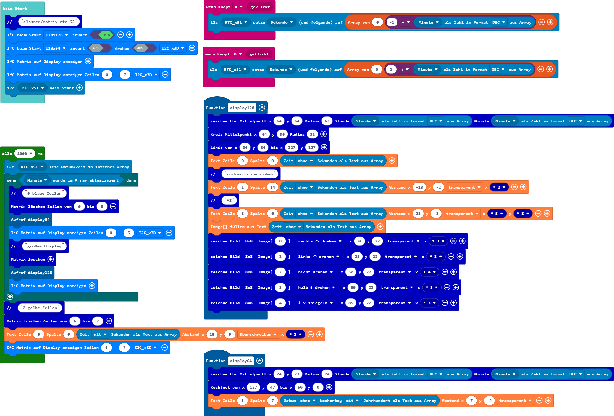
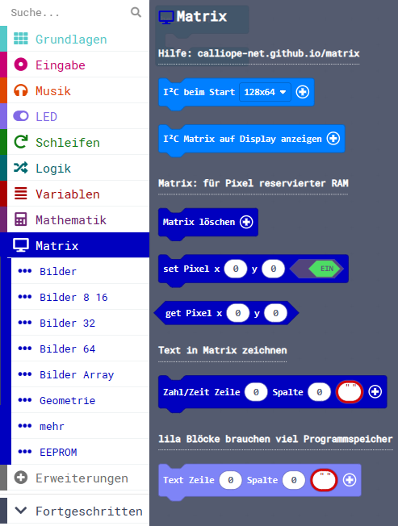
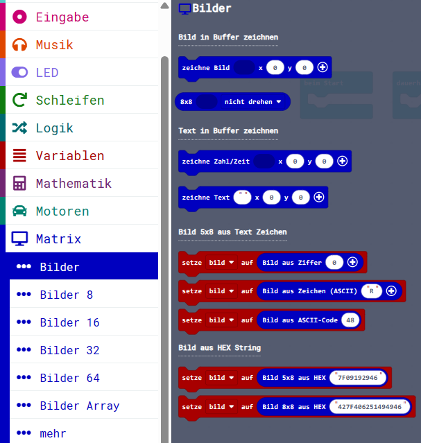
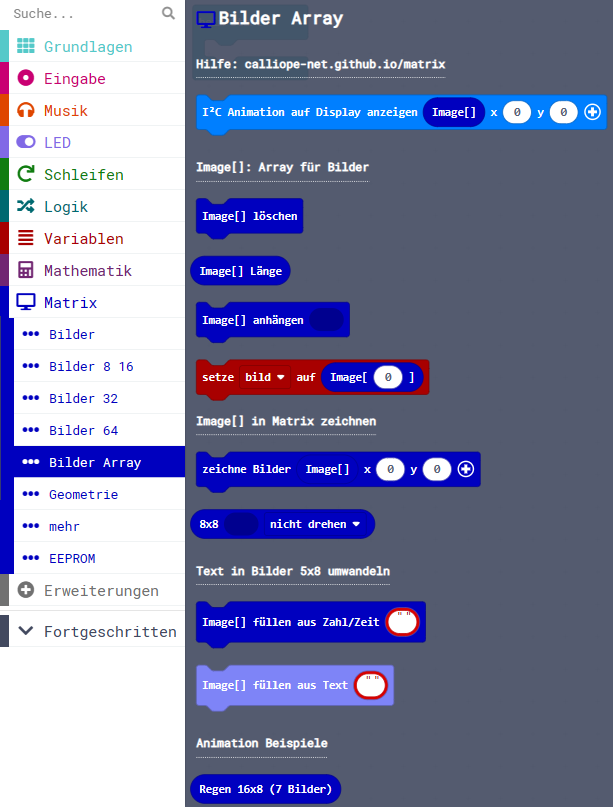
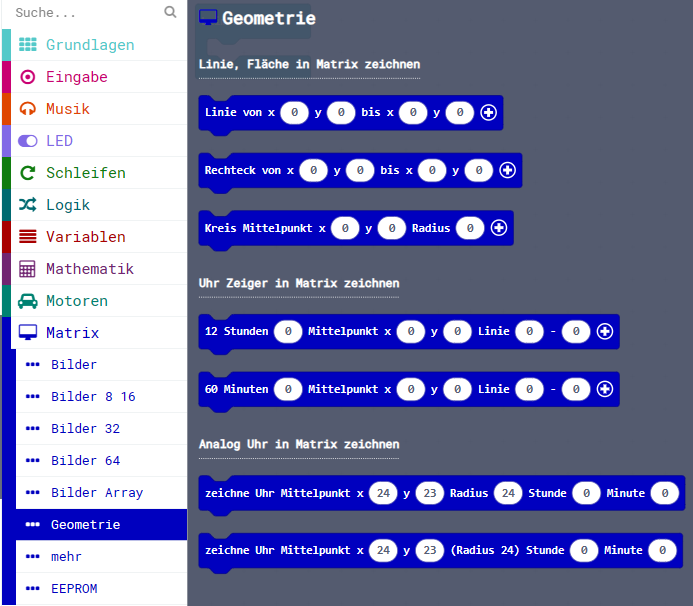
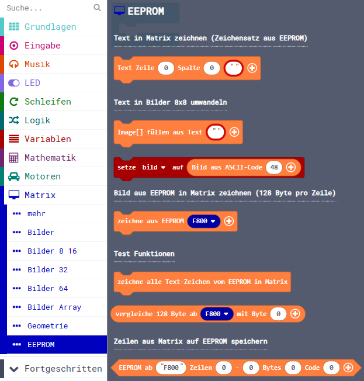

Diese Seite bei [https://calliope-net.github.io/matrix/](https://calliope-net.github.io/matrix/) öffnen.

### Calliope I²C Erweiterung für OLED Displays 128x128 und 128x64 Pixel

> speichert alle Pixel im RAM (2048 oder 1024 Byte), deshalb Calliope mini ab V2 erforderlich

> zeichnet Linien, Rechtecke, Kreise oder eine analoge Uhr

> Bilder verschiedener Größe 5x8 bis 64x64 Pixel mit Blöcken selbst malen

> Text pixelgenau positionieren, drehen, spiegeln, in verschiedene Richtungen zeichnen

> Bilder (auch Text-Zeichen sind Bilder 5x8) vergrößern (in x und y Richtung getrennt strecken)

> mehrere Bilder als Animation anzeigen

> zwei Displays mit verschiedenen I²C Adressen können verschiedene Bilder zeigen

> optional: Qwiic EEPROM an I²C anstecken
> * speichert ASCII Zeichensatz + Umlaute und spart Programmspeicher
> * Bilder speichern und direkt aus dem EEPROM in die Matrix kopieren

Auf dem Foto läuft das folgende Programm mit Hardware v2 und den Erweiterungen:
* [calliope-net/matrix](https://calliope-net.github.io/matrix)
* [calliope-net/rtc-uhr](https://calliope-net.github.io/rtc-uhr)

Die Erweiterung **calliope-net/matrix** unterstützt zwei OLED Displays gleichzeitig, folgende wurden getestet und können beliebig kombiniert werden:

* [Grove - OLED Display 1.12 (SH1107) V3.0 - SPI/IIC -3.3V/5V](https://wiki.seeedstudio.com/Grove-OLED-Display-1.12-SH1107_V3.0/) 
* [Grove - OLED Display 0.96 inch](https://wiki.seeedstudio.com/Grove-OLED_Display_0.96inch/) 
* [Grove - OLED Yellow&Blue Display 0.96(SSD1315) - SPI/IIC -3.3V/5V](https://wiki.seeedstudio.com/Grove-OLED-Yellow&Blue-Display-0.96-SSD1315_V1.0/)
* und optional den EEPROM
* [SparkFun Qwiic EEPROM Breakout - 512Kbit](https://www.sparkfun.com/products/18355)

<!--
_V3.0/img/10402050_Main-02.png) 

_V1.0/img/10402049_Preview-07.png)
-->

Dieses Repository kann als **Erweiterung** in MakeCode hinzugefügt werden.

* öffne Makecode in der App oder die Webseite [https://makecode.calliope.cc/](https://makecode.calliope.cc/)
* klicke auf **Neues Projekt** und gib deinem Projekt einen Namen
* wähle die zu deinem Calliope mini passende Hardware v2 oder v3
* mit Calliope 1.3 (v1) funktioniert diese Erweiterung nicht
* klicke auf **Erweiterungen**
* schreibe die folgende **Projekt-URL**:
* **calliope-net/matrix**
* mit der Tastatur oben in das weiße Feld und klicke auf ENTER
* klicke auf das Rechteck **matrix** (kann von der Tastatur verdeckt sein)
* jetzt hat die Liste den neuen Eintrag **Matrix** bekommen

### Beschreibung der Erweiterung 'Matrix'

#### RAM

> RAM ist der Datenspeicher im Computer. Im Gegensatz zum ROM (Read-Only-Memory) können die Daten im RAM jederzeit vom Programm geändert werden.

→ [de.wikipedia.org/wiki/Random-Access_Memory](https://de.wikipedia.org/wiki/Random-Access_Memory)

> Die Calliope mini Versionen haben unterschiedliche RAM Speicher Kapazität: 1.3=16KB | 2.0 und 2.1=32KB | 3.0=128KB.
> Der RAM wird auch vom Betriebssystem benutzt, so dass für eigene Programme nicht viel übrig bleibt.
> Beim Calliope mini 1.3 reichen die 16KB jedenfalls nicht, um 1KB für die Matrix zu reservieren.

→ [Technische Spezifikation](https://calliope-mini.github.io/v20/)

> 1K steht für 2^10 = 1024 und B für Byte. 1 Byte hat immer 8 Bit. 1KB sind also 8192 Bit, so viele Pixel hat das 128x64 Display.
> Und Pixel sind die kleinen Punkte, die leuchten oder nicht. Weil Bits im RAM nicht leuchten, müssen sie an ein Display gesendet werden.
> Das macht die Erweiterung 'Matrix'.

##### Der für die Pixel reservierte RAM wird in dieser Beschreibung 'Matrix' genannt.

#### I²C

→ [calliope-net.github.io/i2c](https://calliope-net.github.io/i2c/)

Matrix speichert alle Pixel im RAM. Zur Kommunikation mit dem Display über den I²C-Bus gibt es nur 3 Blöcke (hellblau):

* **I²C beim Start** (Display-Größe, invert, drehen, I²C-Adresse)
* **I²C Matrix auf Display anzeigen** (Zeilen von, bis, I²C-Adresse)
* **I²C Animation auf Display anzeigen** (Image[]-Array, Position x, y, vergrößern x, y, Pause(ms), Zeilen von, bis, I²C-Adresse)

## Blöcke und Parameter

#### Matrix

Block **I²C beim Start** (Display-Größe, invert, drehen, I²C-Adresse)

* muss beim Start aufgerufen werden, um die Matrix im RAM und das Display zu initialisieren. 
Die eingestellte *Display-Größe* entscheidet darüber, wieviel RAM reserviert wird. 128x64 reserviert 1KB und 128x128 2KB.
* Der Parameter *invert* stellt ein, ob die Pixel leuchten oder der Hintergrund. 
* Mit *drehen* wird das Bild auf den Kopf gestellt, wenn das Display anders herum eingebaut ist.
* Die *I²C-Adresse* muss nur umgestellt werden, wenn ein zweites Display angeschlossen wird.
* Die optionalen Parameter können weg gelassen werden. Sie werden bei Bedarf mit dem + angezeigt.

> Wenn zwei Displays angeschlossen sind, muss der Block **beim Start** zweimal aufgerufen werden, mit verschiedenen I²C-Adressen.
> RAM wird für das größere Display reserviert. Es gibt nur eine Matrix im RAM, die sich beide Displays teilen.
> Um verschiedene Bilder auf zwei Displays anzuzeigen, wird die Matrix gelöscht, neu gezeichnet und mit dem folgenden Block
> (mit Parameter *I²C-Adresse*) an ein bestimmtes Display gesendet.

Block **I²C Matrix auf Display anzeigen** (Zeilen von, bis, I²C-Adresse)

* ist immer aufzurufen, wenn das in die Matrix gezeichnete Bild auf dem Display angezeigt werden soll.
Dabei wird normalerweise das komplette Display über den I²C-Bus neu geschrieben (1KB oder 2KB Pixel).
* Mit den optionalen Parametern *Zeilen von, bis* ist es möglich, nur einen Teil des Displays zu aktualisieren. 
Eine Zeile ist immer 8 Pixel hoch und 128 Pixel breit, füllt also die gesamte Breite des Displays.
Das 128x64 Display hat damit 8 Zeilen (0-7), das 128x128 Display hat 16 Zeilen (0-15).
* Der Parameter *I²C-Adresse* bestimmt, an welches Display die Matrix gesendet wird.

> Die Zeilen in der Matrix und auf dem Display sind fest zugeordnet. Sie können nicht an eine andere Stelle geschrieben werden.

Block **I²C Animation auf Display anzeigen** befindet sich im Menüpunkt **[Bilder Array](#bilder-array)** und wird dort beschrieben. 

##### Matrix: für Pixel reservierter RAM

Block **Matrix löschen** (Zeilen von, bis)

* Damit werden normalerweise alle Pixel in der Matrix gelöscht.
* Mit den optionalen Parametern (Zeilen von, bis) ist es möglich, nur einen Teil der Matrix zu löschen.
Eine Zeile ist immer 8 Pixel hoch und 128 Pixel breit.

> Um das Display zu löschen, muss eine gelöschte Matrix noch mit dem hellblauen Block **Matrix auf Display anzeigen**
> über den I²C-Bus an das Display gesendet werden.

Block **set Pixel** (x, y, EIN/AUS)

* Schaltet ein Pixel (in der Matrix) EIN oder AUS. 
* Für die Koordinate x sind Werte von 0 (links) bis 127 (rechts) möglich.
* Für die Koordinate y sind Werte von 0 (oben) bis 63 oder 127 (unten) möglich.

Block **get Pixel** (x, y) : boolean

* Liest ein Pixel aus der Matrix als boolean (wahr=EIN, falsch=AUS).

##### Text in Matrix zeichnen

Block **Zahl/Zeit** (Zeile, Spalte, Text:any, Abstand x, y, überschreiben, vergrößern x, y)

* Dieser Block schreibt Text in die Matrix. Der Parameter *Text* kann eine Zahl oder ein Datum (als String) sein.
* Die weiteren Parameter sind im nächsten Block **zeichne Text** beschrieben.

> Hier werden nur die Zeichen Leerzeichen 0 1 2 3 4 5 6 7 8 9 : ; < = > ? - . als Image generiert. Der Zweck ist, Programmspeicher zu sparen. Der Compiler meldet einen Fehler,
> wenn viele Blöcke benutzt werden und im Hintergrund der ganze ASCII Zeichensatz im Code steht. Wenn keine Buchstaben angezeigt werden sollen, ist dieser Block zu bevorzugen.
> Der [orange **Text** Block aus **EEPROM**](#eeprom) kann den Programmspeicher komplett einsparen, wenn ein EEPROM angeschlossen ist.

Block **Text** (Zeile, Spalte, Text:any, Abstand x, y, überschreiben, vergrößern x, y)

* Der lila Block schreibt Text in die Matrix. Der Parameter *Text* kann alle 96 ASCII Zeichen und Ä Ö Ü ä ö ü ß € ° enthalten.
* Eine Zeile (0..7 oder 0..15) ist 8 Pixel hoch, eine Spalte (0..15) ist 8 Pixel breit. An der Stelle steht das erste Zeichen in der Matrix.
* Die optionalen Parameter *Abstand x, y* haben die Standardwerte x=8 und y=0. Das ist der Abstand zum nächsten Zeichen vom Beginn des letzten Zeichens.
Die Standardwerte sind für Text geeignet. Die Zeichen können aber in verschiedene Richtungen, mit negativem Abstand auch rückwärts gezeichnet werden.
Weil alle Text-Zeichen nur 5 Pixel breit sind, können sie auch mit kleinerem Abstand als 8 gezeichnet werden.
* Mit Parameter *überschreiben* werden alle Pixel (die Nullen und die Einsen) vom Image-Objekt in die Matrix gezeichnet.
* Mit Parameter *transparent* werden nur Pixel an geschaltet (die Einsen). Pixel, die vorher schon leuchten, werden nicht aus geschaltet.
So bleibt der Hintergrund sichtbar (transparent).
* Mit den Parametern *vergrößern x, y* kann jedes Pixel mit dem Faktor \*1 \*2 \*3 bis \*8 vervielfacht werden, jede Richtung x und y getrennt.
Bei Vergrößerung >1 müssen die Parameter *Abstand x, y* angepasst werden.

> Die lila Blöcke brauchen den Zeichensatz im Programmspeicher, den der Compiler mit in die HEX Datei einpackt. Diese wird oft zu groß für den Calliope v2.
> Es gibt deshalb drei Blöcke zum Text schreiben.
> 1. Ist der EEPROM angeschlossen, sollte *ausschließlich* der [orange **Text** Block aus **EEPROM**](#eeprom) benutzt werden.
> 2. Der blaue Block **Zahl/Zeit** braucht weniger Programmspeicher, weil auf die Buchstaben verzichtet wird.
> 3. Der lila Block **Text** verbraucht den meisten Programmspeicher. Werden viele Blöcke in MakeCode benutzt, kann der Compiler möglicherweise keine HEX Datei erzeugen.

#### Bilder

> Im Menüpunkt **Bilder** können Bilder (Image-Objekte) aus verschiedenen Quellen erzeugt und in Variablen gespeichert werden.
> Mit dem oberen Block **zeichne Bild** muss jedes Image-Objekt (Variable) dann an einer bestimmten Position (x, y) in die Matrix gezeichnet werden.
> Blöcke für eine Folge von Bildern (Text, Animation) befinden sich im Menüpunkt **[Bilder Array](#bilder-array)**.

##### ein Bild in Matrix zeichnen

Block **zeichne Bild** (Image-Objekt, x, y, überschreiben, vergrößern x, y)

* In den 1. Parameter *Image-Objekt* muss eine Variable *bild* oder ein Block, der ein Image-Objekt zurück gibt, eingetragen werden.
* Die Koordinaten *x, y* sind die linke obere Ecke, wo das Bild aus dem Image-Objekt in die Matrix gezeichnet wird. 
Dabei wird die volle Breite und Höhe des Bildes übertragen (bis zum Rand der Matrix).
* Mit Parameter *überschreiben* werden alle Pixel (die Nullen und die Einsen) vom Image-Objekt in die Matrix gezeichnet.
* Mit Parameter *transparent* werden nur Pixel an geschaltet (die Einsen). Pixel, die vorher schon leuchten, werden nicht aus geschaltet.
So bleibt der Hintergrund sichtbar (transparent).
* Mit den Parametern *vergrößern x, y* kann jedes Pixel mit dem Faktor \*1 \*2 \*3 bis \*8 vervielfacht werden, jede Richtung x und y getrennt.

Block **8x8 drehen** (Image-Objekt, drehen oder spiegeln)

* Dieser Block kann in den Block darüber **zeichne Bild** eingefügt werden, um ein *Image-Objekt* zu drehen oder zu spiegeln, bevor es in die Matrix gezeichnet wird.
* Das neue Bild hat immer die Größe 8x8 Pixel. War das Original größer, wird nur die linke obere Ecke verwendet.
* Der Block ist damit besonders für Text-Zeichen geeignet. Ziffern, Buchstaben u.a. sind 5x8 Images und werden auf 8x8 vergrößert (rechts 3x8 Pixel weißer Rand).
* Diese Optionen stehen zur Verfügung: nicht drehen, links ↶ drehen, rechts ↷ drehen, halb ⤸ drehen, ↔ y spiegeln, ↕ x spiegeln.

##### ein Zeichen in Bild 5x8 umwandeln

> Die folgenden Blöcke generieren ein Image-Objekt und weisen das direkt einer Variable zu. Der Name der Variable *bild* wird bei wiederholter Verwendung mit einer Ziffer ergänzt,
> so dass immer neue Variablen-Namen entstehen. Diese Variablen sind im Menüpunkt *Variablen* zu finden und können in Blöcken wie **zeichne Bild**, **8x8 drehen** oder **Image[] anhängen**
> verwendet werden.

Block *setze bild auf* **'Leerzeichen'** (zeichen)

* Generiert aus einem *zeichen* in der DropDownList ein Bild 5x8 Pixel.
* Hier werden nur die Zeichen Leerzeichen 0 1 2 3 4 5 6 7 8 9 : ; < = > ? - . als Image generiert, um Programmspeicher zu sparen.

Block *setze bild auf* **Bild aus ASCII-Code** (charCode)

* Dieser lila Block generiert aus allen 96 ASCII Zeichen (*charCode* 32-127) und Umlauten ein Bild 5x8 Pixel.
* Es gibt unter EEPROM einen orange Block mit gleicher Funktion, der Programmspeicher spart (und noch mehr Zeichen ermöglicht).

##### Bild aus Hexadezimalzahl

> Eine Ziffer einer Hexadezimalzahl kann 16 Werte annehmen: (0 1 2 3 4 5 6 7 8 9 A B C D E F). Das entspricht genau 4 Bit. Für ein Byte (8 Bit) werden 2 HEX-Ziffen geschrieben.
> 5 Byte entstehen also aus 10 HEX-Ziffern und 8 Byte entstehen aus 16 HEX-Ziffern.

Block *setze bild auf* **Bild 5x8 aus HEX** (Hexadezimalzahl)

* Generiert aus 5 Byte in HEX-Darstellung ein Bild 5x8 Pixel. Das erste Byte bildet den linken Rand. Bit 0 ist oben, Bit 7 ist unten. Die anderen Bytes folgen rechts daneben.
* Das Beispiel 7F09192946 zeichnet den Buchstabe R. 7F zeichnet den durchgehenden Strich 7 Pixel hoch. Das untere Pixel ist bei Text-Zeichen immer 0 (Zeilenabstand).

Block *setze bild auf* **Bild 8x8 aus HEX** (Hexadezimalzahl)

* Generiert aus 8 Byte in HEX-Darstellung ein Bild 8x8 Pixel. Dazu werden 16 HEX-Ziffern verarbeitet.
* Das Beispiel 427F406251494946 zeichnet die Zahl 12 auf 8 Pixel zusammen gedrückt. Dieses Sonderzeichen ist für die Analog Uhr geeignet.

##### Image Objekte

Block *setze bild auf* **Bild 8x8** (MATRIX)

* Hier wird die 8x8 Matrix angezeigt. Weitere Größen befinden sich in den folgenden Menüpunkten: 

#### Bilder 8 16 | Bilder 32 | Bilder 64

> In den Menüpunkten **Bilder xx** stehen Blöcke zur Verfügung, in die eigene Bilder verschiedener Größe mit dem MakeCode Editor gemalt werden können.
> Die blauen Blöcke geben ein Image-Objekt zurück, das entweder einer Variablen *bild* zugewiesen wird, oder in einem der Blöcke **zeichne Bild**, **8x8 drehen** oder **Image[] anhängen**
> direkt verwendet werden kann.

Folgende Bild-Größen (Breite x Höhe in Pixel) stehen zum selbst Malen zur Verfügung:

* Bild 5x8
* Bild 8x8
* Bild 16x8
* Bild 16x16
* Bild 32x8
* Bild 32x32
* Bild 64x8
* Bild 64x64

> Jede Vorlage kann mehrmals verwendet und verschiedenen Variablen zugewiesen werden. Die zahlreichen Image-Objekte können dann mit **zeichne Bild**
> wie Kacheln an verschiedenen Stellen in die Matrix gezeichnet werden. Dabei können kleine Bilder auch vergrößert werden.

> Die Bilder (Image-Objekte) können aber auch im Menüpunkt **Bilder Array** im internen Array Image[] gesammelt werden.
> Sie können dort über den Index einzeln abgerufen oder als Animation auf dem Display angezeigt werden.

#### Bilder Array

> Bilder-Array ist ein Array im RAM mit Elementen vom Typ Image. Image ist in MakeCode ein Typ. In den Blöcken ist dieses interne Array mit **Image[]** bezeichnet.
> Ein Image-Objekt kann eine bestimmte Anzahl Pixel in Breite und Höhe speichern, also ein Bild. (1 Bit pro Pixel.)

Block **I²C Animation auf Display anzeigen** (Image[], Position x, y, vergrößern x, y, Pause(ms), Zeilen von, bis, I²C-Adresse)

* Für eine Animation werden mehrere Bilder mit kurzer Pause an der selben Stelle angezeigt. Die Bilder sind in einem Array gespeichert.
Es wird jeweils 1 Bild in die Matrix gezeichnet, **Matrix auf Display anzeigen** aufgerufen und eine Zeit in Millisekunden gewartet.
Das wiederholt sich, bis alle Elemente aus dem Array Image[] abgearbeitet sind.

* Als Parameter ist das interne Array Image[] eingestellt. Es kann auch ein eigenes Array mit Bildern übergeben werden. *Position x, y* ist die linke obere Ecke,
wo alle Bilder aus dem Array nacheinander in die Matrix gezeichnet werden. Dabei wird die volle Breite und Höhe jedes Bildes übertragen (bis zum Rand der Matrix).

* Mit den Parametern *vergrößern x, y* kann jedes Pixel mit dem Faktor \*1 \*2 \*3 bis \*8 vervielfacht werden, jede Richtung x und y getrennt.
So können kleine Bilder auch größer gezeichnet werden.

* Der Parameter *Pause(ms)* legt fest, wie lange jedes Bild während der Animation angezeigt wird.

* Die letzten Parameter *Zeilen von, bis* und *I²C-Adresse* entsprechen dem Block **I²C Matrix auf Display anzeigen**.
Damit kann verhindert werden, dass immer das gesamte Display über den I²C-Bus neu geschrieben wird, wenn die Bilder der Animation kleiner sind.
Wenn die Bilder an Position x, y = (0,0) 8 Pixel hoch und nicht vergrößert sind, reicht es die Zeile 0 zu aktualisieren.

##### Image[]: Array für Bilder

Block **Image[] löschen**

* Setzt das interne Array Image[] auf ein leeres Array mit 0 Elementen.

Block **Image[] Länge**

* Gibt die Anzahl der Bilder im internen Array zurück.

Block **Image[] anhängen** (Image-Objekt)

* Als Parameter ist ein Bild (Image-Objekt) zu übergeben, welches an das interne Array Image[] angehängt wird. Das kann eine - in den anderen
Menüpunkten automatisch erzeugte - Variable *bild* sein oder direkt ein Bild-Block in dem die Pixel angeklickt werden können.

Block *setze bild auf* **Image[]** (index)

* Gibt ein Bild (ein Element aus dem Array Image[]) zurück und weist es der Variable *bild* zu.

##### Image[] in Matrix zeichnen

Block **zeichne Bilder** (Image[], Position x, y, Abstand x, y, überschreiben, vergrößern x, y)

* Die Bilder im Array *Image[]* werden an *Position x, y* beginnend versetzt in die Matrix gezeichnet. Sonst würden sie sich überschreiben.
Das wird z.B. für Text verwendet, weil jeder Buchstabe ein Bild 5x8 Pixel ist. Der *Abstand x, y* wäre für Text x=8 und y=0. 
Es ist aber möglich die Buchstaben, oder auch größere Bilder aus dem Array, nach oben, unten und mit negativem Abstand auch zurück zu versetzen.

* Mit Parameter *überschreiben* werden alle Pixel (die Nullen und die Einsen) vom Image-Objekt in die Matrix gezeichnet.
Mit Parameter *transparent* werden nur Pixel an geschaltet (die Einsen). Pixel, die vorher schon leuchten, werden nicht aus geschaltet.
So bleibt der Hintergrund sichtbar (transparent).

* Mit den Parametern *vergrößern x, y* kann jedes Pixel mit dem Faktor \*1 \*2 \*3 bis \*8 vervielfacht werden, jede Richtung x und y getrennt.
Der Faktor gilt für alle Bilder im Array. Gegebenenfalls müssen die Parameter *Abstand x, y* angepasst werden.

> Um die in die Matrix gezeichneten Bilder auf dem Display anzuzeigen, muss noch der hellblaue Block **Matrix auf Display anzeigen** aufgerufen werden.

Block **8x8 drehen** (Image-Objekt, drehen oder spiegeln)

* Dieser Block kann in den Block darüber **zeichne Bilder** eingefügt werden, um alle Bilder in einem Array zu drehen oder zu spiegeln, bevor sie in die Matrix gezeichnet werden.
* Das neue Bild hat immer die Größe 8x8 Pixel. War das Original größer, wird nur die linke obere Ecke verwendet.
* Der Block **8x8 drehen** ist damit besonders für Text-Zeichen geeignet. Ziffern, Buchstaben u.a. sind 5x8 Images und werden auf 8x8 vergrößert (rechts 3x8 Pixel weißer Rand).
* Diese Optionen stehen zur Verfügung: nicht drehen, links ↶ drehen, rechts ↷ drehen, halb ⤸ drehen, ↔ y spiegeln, ↕ x spiegeln.

##### Text in Bilder 5x8 umwandeln

Block **Image[] füllen aus Zahl/Zeit** (Text:any)

* Dieser Block schreibt Text nicht direkt in die Matrix, sondern Zeichen für Zeichen als Bild in Image[].
* Hier werden wieder, um Programmspeicher zu sparen, nur 0 1 2 3 4 5 6 7 8 9 : ; < = > ? - . als Image generiert.

Block **Image[] füllen aus Text** (Text:any)

* Dieser lila Block schreibt Text nicht direkt in die Matrix, sondern Zeichen für Zeichen als Bild in Image[].
* Die einzelnen Bilder der Buchstaben können wie Bilder behandelt und z.B. pixelgenau positioniert werden. Mit den **Text** Blöcken geht das nur Zeilen- und Spaltenweise.
* In den Text können selbst gemalte Zeichen (griechische, römische, ...) eingefügt werden.
* Es gibt unter EEPROM einen orange Block mit gleicher Funktion, der Programmspeicher spart (und noch mehr Zeichen ermöglicht).

##### Animation Beispiele

* Hier können fertige Arrays mit Bildern abgerufen werden. Diese Beispiel-Arrays sind in den Block **Animation auf Display anzeigen**
einzufügen (und ersetzen dort Image[]).

#### Geometrie

##### Linie, Fläche in Matrix zeichnen

Block **Linie** (von x, y, bis x, y, Pixel EIN/AUS)

* Zeichnet eine Linie mit den angegebenen Koordinaten. Mit *Pixel* AUS werden die Pixel gelöscht.

Block **Rechteck** (von x, y, bis x, y, Pixel EIN/AUS)

* Zeichnet ein Rechteck mit den angegebenen Koordinaten. Mit *Pixel* AUS werden die Pixel gelöscht.

Block **Kreis** (Mittelpunkt x, y, Radius, Pixel EIN/AUS)

* Zeichnet einen Kreis mit den angegebenen Koordinaten. Mit *Pixel* AUS werden die Pixel gelöscht.

→ Für Linie und Kreis wird der Bresenham-Algorithmus verwendet: [de.wikipedia.org/wiki/Bresenham-Algorithmus](https://de.wikipedia.org/wiki/Bresenham-Algorithmus)

##### Uhr Zeiger in Matrix zeichnen

Block **12 Stunden** (Stunde, Mittelpunkt x, y, Linie von, bis, Pixel EIN/AUS)

* Der Parameter *Stunde* bestimmt die Richtung (den Winkel) der Linie vom *Mittelpunkt x, y* (auf dem Zifferblatt einer Uhr).
* Der "kleine Zeiger" muss nicht im Mittelpunkt beginnen. Die Parameter *Linie von, bis* bestimmen Anfang und Ende des Zeigers (vom Mittelpunkt in Pixeln).
* Mit *Pixel* AUS kann der Zeiger auch wieder gelöscht werden.

Block **60 Minuten** (Minute, Mittelpunkt x, y, Linie von, bis, Pixel EIN/AUS)

* Funktioniert wie **12 Stunden**, allerdings sind hier nicht 12, sondern 60 Positionen des Zeigers möglich.

→ Die Funktionen für die Uhrzeiger hat ein Schüler im GTA programmiert.

##### Analog Uhr in Matrix zeichnen

Block **zeichne Uhr** (Mittelpunkt x, y, Radius, Stunde, Minute)

* Verwendet die oben beschriebenen Funktionen, um eine komplette analoge Uhr zu zeichnen.

#### EEPROM

##### Text in Matrix zeichnen

Block **Text** (Zeile, Spalte, Text:any, Abstand x, y, überschreiben, vergrößern x, y, EEPROM Startadresse, I²C Adresse)

* Dieser Block schreibt Text in die Matrix. Der Parameter *Text* kann Zeichencodes von 0 bis 255 enthalten, wenn dafür Zeichen "Bitmuster" im EEPROM programmiert sind.
Aktuell sind alle 96 ASCII Zeichen und Ä Ö Ü ä ö ü ß € ° enthalten.
* Im EEPROM sind dafür die letzten 2 KB F800-FFFF reserviert. Diese *EEPROM Startadresse* kann geändert werden.
* Ebenfalls kann die *I²C Adresse* das EEPROM geändert werden.
* Die anderen Parameter sind [weiter oben](#text-in-matrix-zeichnen) beschrieben.

> Wenn ein EEPROM mit Zeichensatz angeschlossen ist, sollte ausschließlich der orange **Text** Block benutzt werden.
> Der blaue und lila **Text** Block würden Speicherplatz verschwenden, der beim Programmspeicher fehlt.
> **Auf einem MakeCode Bildschirm sollten also nie lila und orange Blöcke gleichzeitig sein!**

##### Text in Bilder 5x8 umwandeln

##### Bild aus EEPROM in Matrix zeichnen (128 Byte pro Zeile)

##### Test Funktionen

##### Zeilen aus Matrix im EEPROM speichern

### Erweiterungen

> [Upates für Erweiterungen; Erweiterungen aus einem Projekt löschen.](https://calliope-net.github.io/i2c-liste#updates)

> [Alle I²C-Erweiterungen für MakeCode von calliope-net (Software).](https://calliope-net.github.io/i2c-liste#erweiterungen)

#### Calliope-Apps, .hex-Dateien, Bildschirmfotos mit Blöcken

> [Alle Beispiel-Projekte für MakeCode von calliope-net (Calliope-Apps).](https://calliope-net.github.io/i2c-liste#programmierbeispiele)

> GitHub-Profil calliope-net: [https://github.com/calliope-net](https://github.com/calliope-net)

### Bezugsquellen

> [Alle I²C-Module und Bezugsquellen (Hardware).](https://calliope-net.github.io/i2c-liste#bezugsquellen)

#### Blocks preview 

This image shows the blocks code from the last commit in master.
This image may take a few minutes to refresh.

#### Metadaten (verwendet für Suche, Rendering)

* Calliope mini
* I²C
